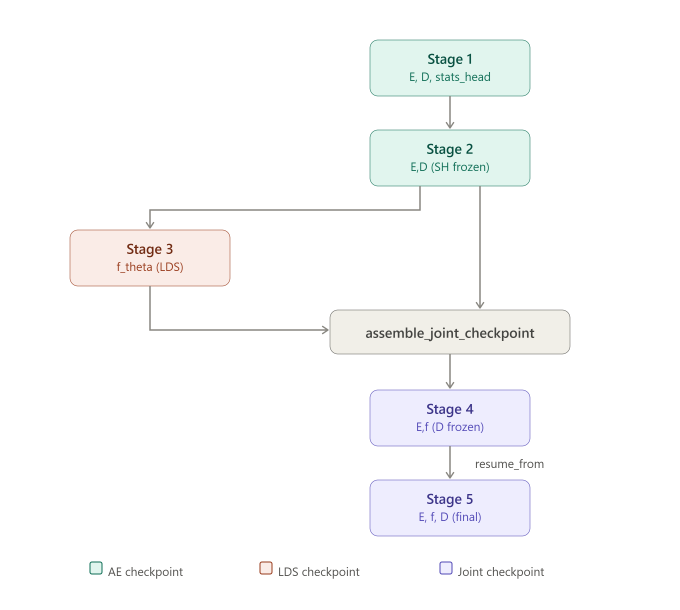

# Neural networks: autoencoder and surrogate evolution


See [./docs/NN-code_structure.md](NN-code_structure.md) (written by Claude) for more details on the structure of the code.


## Strategy

### Goal

Phase-field simulations are used in materials science and engineering (MSE) to study microstructure evolution. They repeatedly solve physical partial differential equations (PDE). The goal is for a neural network (NN) 
to learn the relationship between successive microstructures to accelerate phase-field simulations while preserving the underlying physics.


### Predicting in latent space

LIENS (Latent Interface Evolution Neural Surrogate) learns a reduced-order representation of the phase-field state together with a surrogate evolution operator acting in that latent space. 
Morphological statistics of the microstructure are used to complement pixel fidelity.

Working directly in latent space is faster (it is smaller than real space), but _a priori_ we cannot do arithmetic in it. 

Training the AE (stage 1) ensures that the microstructure (the state) can be reconstructed in real space. This means that the latent representation $z_0$ somehow describes $x$, not that is a smooth and structured coordinate system. 

### Split latent space
One wants to get a latent representation which could reconstruct, while preserving internal logic. We introduce a split latent channel:
- $z_0$ encodes the microstructure (the "state", 0th order): $z_0(t)$ is such that $D(z_0(t))$ recovers $x_0(t)$;
- $z_1$ encodes the time derivative (1st order): $\mathrm{d}z_0 / \mathrm{d}t = \dot{z}_0$ (unlike $z_0$, $z_1$ is not decoded: it works purely in latent space). 

A Taylor expansion of $z_0$ gives

$$z_0(t + \delta t) = z_0(t) + \dot{z}_0(t) \delta t + \ddot{z}_0(t) (\delta t^2/2) + o(\delta t^2).$$

The idea is to replace $\dot{z}_0$ with $z_1$ by training in stage 2, and $\ddot{z}_0$ with $f_\theta$ (stage 3).


### A tale of two time steps
Notations:
- $\delta t$ is some arbitrary time step,
- $\Delta t$ is specifically $t_{n+1} - t_n$ in `./datasets/`, it exists only during training.

The idea, in stage 3b, is to mimic inference on an unknown time evolution, where:
- $\delta t$ can be chosen freely,
- everything will be recalculated at every time step because there is nothing else available after training.

If $\delta t$ is small enough, error can be contained. Note: at $\delta t \to 0$, the convergence is towards a model, not an underlying truth (e.g. phase field).


### Stepping in log-time (the `u`-scheme)
The microstructure does not evolve according to a linear clock. This is why the phase-field simulations save with an incresing $\Delta t$ step.

The *u-scheme* steps in log-time. We define

$$u = \log_{10} t, \qquad \Delta u = \log_{10}(t_\mathrm{end}/t_\mathrm{start}),$$

and train $f_\theta$ to advance $z_0$ by $\Delta u$ rather than $\Delta t$. A fixed $\Delta u$ corresponds to a geometric step in physical time.

Two first consequence is that the derivative rescales: since
$\mathrm{d}z_0/\mathrm{d}u = \ln(10)  t   \mathrm{d}z_0/\mathrm{d}t$, 
the stored derivative latent becomes $\tilde{z}_1 = \ln(10) t z_1$ (the dataset applies this at construction). 
Second, the loss weighting must stay in physical time: $f_\theta$ steps in $\Delta u$, but $L_\mathrm{rollout}$ and its per-decade weights are computed against the physical $\Delta t$ ($\Delta u$ is nearly constant). 


## The pipeline at a glance

The stages each build on the previous one(s).
1. Stage 1 encodes the microstructure ($z_0$, order 0);
2. Stage 2 encodes the time derivative ($z_1$, order 1);
3. Stage 3 learns $z(t+\delta t)$ from $z(t)$ ($f_\theta$, order 2);
4. Stages 4 and 5 put this together, seeking a latent representation balancing reconstruction and dynamics prediction. 

$f_\theta$ is different from $z_0$ and $z_1$:
- $z_0$ and $z_1$ are supervised directly against data, never in feedback with themselves;
- $f_\theta$ is a learned corrector: trained through a prediction objective, and its output re-enters its own input at the next sub-step.
Currently, the first type works more reliably than the other.


### Synoptic table

| \# | stage          | input      | output    | aim                        |
|---|-----------------|------------|-----------|----------------------------|
| 1 | autoencoder ($z_0$)| $x_0$ | $z_0$ | $D[z_0(t)] \approx x_0(t)$ |
| 2 | derivative ($z_1$) | $x_0$ | $z_1$ | $z_0(t) + z_1(t) \delta t \approx z_0(t+\delta t)$, i.e. $z_1(t) \approx \dot{z}_0(t)$; while maintaining $D[z_0(t)] \approx x_0(t)$ |
| 3a | LDS, one step  | $z_0$, $z_1$| $f_\theta$ | $z_0(t) + z_1(t) \Delta t + f_\theta(z_0(t), z_1(t), \Delta t) \Delta t \approx z_0(t+\Delta t)$ |
| 3b | LDS, rollout   |        "        | "    |  as 3a, chained |


### Stages, losses and checkpoints

There are seven losses, which can be mixed and matched at the different stages:
- reconstruction loss: `L_recon0`,
- statistics loss: `L_stats0`,
- derivative loss: `L_deriv`,
- one-step latent prediction loss: `L_1step`,
- multi-step rollout loss (latent space): `L_rollout`,
- reconstruction after multi-step rollout: `L_recon_predict` (state, real space) and `L_grad_predict` (gradient, real).

For each loss `XX`:
- `XX_scale` normalize the loss for it to be around 1 (objective),
- `XX_weight` is the importance given to a certain loss at a certain stage (a choice).
What is concretely used in the loss function: `XX_weight * L_XX / XX_scale`.

For simplicity, the ratios of the weights `L_stats0 / L_recon0` and `L_grad_predict / L_recon_predict` tend to be conserved between stages.

Interpolation loss, $L_\mathrm{interp}$, is no longer used in loss function.


| \#| Stage             | Trained | Frozen | Unused | Space | Snapshots | Loss                            |
|---|-------------------|--------------|------|------|-------|-------|---------------------------------|
| 1 a| autoencoder ($z_0$)|E, D, SH|   | f    | real  | 1    | `L_recon0 + λ L_stats0`           |
| 2 | derivative ($z_1$) |E*, D*| SH | f | both | 3 | `L_recon0 + λ L_stats0 + λ₁ L_deriv` |
| 3a| LDS               | f       | E, SH | D | latent| 2    | `L_1step + λ₁ L_deriv`           |
| 3b| LDS               | f       | E, SH | D | latent| $n+1$  | `L_rollout + ε L_1step + λ₁ L_deriv` |
| 4 | encoder refinement| E, f  | D, SH|  | latent†|$n+1$|`L_rollout + ε L_stats0 + ε₁ L_recon0 + ε₂ L_recon_predict + ε₃ L_grad_predict` |
| 5 | end-to-end        | E, f, D | SH  |      | real  | $n+1$ | `L_recon_predict + λ L_grad_predict + ε L_recon0 + ε₁ L_stats0 + ε₂ L_rollout` |

Notes:
- SH: `stats_head`, $n$: `n_rollout_steps`;
- ${}^\ast$: outter layers frozen;
- ${}^\dagger$: mostly.





## Stage 1: representation


### Architecture
The convolutional autoencoder has a symmetric encoder–decoder architecture. The encoder depth scales with the (square) system size so that the spatial bottleneck remains 8×8: three downsampling stages for 64×64 inputs (64→32→16→8), five for 256×256, and so on. Each resolution level consists of two 3×3 convolutions (circular padding to match periodic boundaries) with ReLU activations, followed by a stride-2 convolution for downsampling (mirrored by learned upsampling in the decoder), with BatchNorm/LayerNorm.

The encoder terminates with a 1×1 convolution reducing the feature dimension to 8 channels, yielding an 8×8×8 latent representation. This bottleneck retains coarse spatial organization while reducing the dimensionality sufficiently for efficient latent-space dynamics. Initial runs will use a larger latent space, to ensure that sufficient information is available for reconstruction, before shrinking it to find the lower bound for accuracy.
 

### Dataset expansion
From each snapshot, more are created through
- mirror (horizontal and vertical);
- rotation by ±90°, 180°;
- transposing;
- translation by (Nx/2, 0), (0, Ny/2), (Nx/2, Ny/2) thanks to periodic boundaries


### Reconstruction loss
Compare $x' = D(E(x))$, the microstructure recovered by the AE, to $x$: $L_\mathrm{recon} = \left\| x' - x \right\|_2^2$. 
This is done in real space. $L_1$ may be used if sharper interfaces are desired.


### Physics-informed statistics loss
Letting $s_i(x)$ denote the normalized _i_-th (out of $N_s$) microstructural statistic (measured, real), $g_i(z)$ the value of that normalized statistic in the `stats_head` (latent) and $w_i$ its weight,

$$L_\mathrm{stats} = \sum_{i=1}^{N_s} w_i \left[g_i(z) - s_i(x)\right]^2.$$

(Currently, $w_i \forall i$.) 
$g_i$ cannot be the statistics of $x$ in the real world, since this would say nothing about latent representation.


#### Motivation
The latent representation serves two purposes:
- recover the microstructure in real space (decoder),
- predict the microstructure at $t + \Delta t$.

The reconstruction loss alone does not constrain the latent representation to preserve physically meaningful features. Auxiliary losses in the `stats_head`, based on microstructural statistics, nudge the encoder toward latent variables that capture characteristics such as phase fraction, interface density, anisotropy and characteristic length scales. This is expected to improve latent-space organization and, consequently, the accuracy and stability of the learned surrogate dynamics.


#### Statistics
- Overall metrics:
  - average(OP)
  - stdev(OP)
  - fraction(OP < 0.1) and fraction(OP > 0.9) [in the case of an order parameter between 0 and 1]
  - energy
- fraction in grain boundary (GB):
  - average norm of OP gradients
- Anisotropy (see below)
- Length scale:
  - first peak in autocorrelation: length and strength.


#### No live calculations
I just have a small dense net (`stats_head`) with $N_s$ output cells and say: "the values of these must match the statistics calculated in real space", without recalculating the statistics on x' (let alone on $\hat{z}$). Statistics are auxiliary prediction targets rather than differentiable image-derived losses. The statistics head is trained in latent space, only from ground-truth statistics computed offline.

With `latent_channels` == 8 and `hidden_dim` == 16:
```text
  latent (512)
      ↓
Linear(512 → 16)
    ReLU
Linear(16 → Ns)
```


#### Anisotropy
Compute, pixel by pixel, 

$$J_\sigma = G_\sigma \ast \left(\nabla z\ \nabla z^{\top}\right),$$

with $G_\sigma$ Gaussian kernel. Compute eigenvalues $\lambda_1 \ge \lambda_2$ and eigenvectors $v_1$ and $v_2$. Derive:
- Anisotropy measure: $A = (\lambda_1 - \lambda_2) / (\lambda_1 + \lambda_2 + \varepsilon)$, with $\varepsilon > 0$ a small constant for numerical stability.
  - $A \approx 0$: isotropic,
  - $A \approx 1$: strong directional structure.
- Local orientation (normal direction): $\arctan(v_{1y} / v_{1x})$.	


## Stage 2: latent geometry


### Derivative loss
The goal of stage 2 is to have a meaningful latent representation of the relationship between $C_0$ and $C_1$, $z_1 \approx \mathrm{d}z_0 / \mathrm{d}t$, by training $z_1(t)$ against (something like) $[z_0(t+\Delta t) - z_0(t)] / \Delta t$ directly (`L_deriv`). This makes latent-space arithmetic more intuitive: we can have the prediction 

$$\tilde{z}_0(t + \Delta t) = z_0(t) + z_1(t) \Delta t + \dot{z}_1(t) (\Delta t^2/2).$$

This involves adding `L_deriv` to the loss function of stage 1 (with a paired-window dataset for derivative calculation). Note: in stage 1 the small dense NN for the statistics is trained along the encoder and decoder, in 2 it is frozen.

In stage 2, we are changing the latent representation, while maintaining the reconstruction of $z_0$. We can freeze the outter layers of both encoder and decoder (not those close to the latent space) for regularization.

#### Calculating the derivative
To be precise, we use a symmetric, second-order discretization. We expand $z_0(t+\Delta t_+)$ and $z_0(t-\Delta t_-)$. The weighted sum, $z_0(t+\Delta t_+) / {\Delta t_+}^2 - z_0(t-\Delta t_-) / {\Delta t_-}^2$, removes the second-order term, and one finally obtains 

$$\dot{z}_0(t) = \frac{z_0(t+\Delta t_+) {\Delta t_-}^2 - z_0(t-\Delta t_-) {\Delta t_+}^2 - z_0(t) ( {\Delta t_-}^2 - {\Delta t_+}^2) }{(\Delta t_+ + \Delta t_-)\Delta t_+ \Delta t_- } + o(\Delta t_+) + o(\Delta t_-).$$

$z_1(t)$ is trained against this.


### Interpolation
Interpolation in latent space should preserve physical plausibility, not just visual smoothness.
One takes $t_1 < t_2 < t_3$ three successive time steps in the same simulation, with real states $x_i$ and latent representations $z_i = E(x_i)$. We compare $z_2$ to the interpolated $\tilde{z} = (1-\alpha) z_1 + \alpha z_3$, with $\alpha = (t_2-t_1) / (t_3-t_1)$: `L_interp` is $\|\tilde{z} - z_2\|^2$.


### Perturbation
Let $z_{\varepsilon} = z + \varepsilon   \eta$, with $\eta \sim \mathcal{N}(0, 1)$. One expects that $\mathrm{stats}(z_{\varepsilon}) \approx \mathrm{stats}(z) + \varepsilon \Delta S$. So a linear regression of $\|\mathrm{stats}(z_{\varepsilon}) - \mathrm{stats}(z)\|$ with several values of $\varepsilon$ can nudge towards:
- intercept $\approx 0$ (no discontinuity),
- $R^2 \approx 1$ (e.g. not curvature). 
Variant: structured perturbations (directional latent shifts) instead of isotropic noise.

Perturbation is currently used as _post-hoc_ diagnostic, not as loss function.


## Stage 3: latent dynamics (LDS)

Provided with $x(t)$, stage 1 trained the model to make $z_0(t)$ and stage 2 added $z_1(t)$ (initialization). One must now learn $z_0(t+\Delta t)$ and $z_1(t+\Delta t)$ from them.

Since the autoencoder is frozen in stages 3a and 3b, the latent representation of each microstructure in the `datasets/` can be calculated just once and cached: it will not change in the loop over epochs. This makes this stage run faster (but encoder errors are necessarily inherited).


### fθ and dz1 / dt
$f_\theta$ does not need to be trained to the first-order term, it only needs to learn $\ddot{z}_0$ (curvature, ${}\approx \dot{z}_1$), plus the gap between $z_1$ and $\dot{z}_0$. 
Thus $f_\theta(z_0(t), z_1(t))$ should be trained against

$$[z_0(t + \Delta t) - z_0(t) - z_1(t) \Delta t] / \Delta t,$$

with $\theta$ (currently just the temperature: in the form of $T-T_0$, and $\ln(T_0-T)$ to handle $T$ close to $T_0$) as further input.
Finally,

$$z_0(t + \delta t) \approx z_0(t) + z_1(t) \delta t + f_\theta(z_0(t), z_1(t), \delta t) \delta t.$$

Under the `u`-scheme (above) the same $f_\theta$ steps in $u = \log_{10} t$: read $\Delta u$ for $\Delta t$, $\tilde{z}_1 = \ln(10) t z_1$ for $z_1$, and the integration $z_0(u+\Delta u) \approx z_0 + \tilde{z}_1 \Delta u +
f_\theta(\ldot) \Delta u$ is identical in form.


### One-step latent prediction loss
Compare the prediction to the ground truth in latent space:

$$L_\mathrm{1step} = \left\| z_0(t+\Delta t) - [z_0(t) + z_1(t) \Delta t + f_\theta(z_0(t), z_1(t), \Delta t) \Delta t] \right\|_2^2.$$

Doing so in latent space avoids reliance on the decoder, cleanly separating decoder loss and prediction loss.

### Multi-step rollout loss
By having several predictions in a row, we let error accumulate:

$$z_0(t_{k}) \xrightarrow{f} \hat{z}_0(t_{k+1}) \xrightarrow{f} \hat{z}_0(t_{k+2}) \xrightarrow{f} \hat{z}_0(t_{k+3}) \xrightarrow{f} \ldots.$$

When starting from the snapshot at time $t_k$, the rollout loss is:

$$L_\mathrm{rollout} = \sum_{i=1}^{N_r} \left\| \hat{z}_0(t_k + i \Delta t) - z_0(t_k + i \Delta t) \right\|_2^2,$$

where 

$$\hat{z}_0(t_k + (i+1) \Delta t) = \hat{z}_0(t_k + i \Delta t) + z_1(t_k + i \Delta t) \Delta t + f_\theta(t_k + i \Delta t) \Delta t.$$

Perhaps weigh later predictions slightly more? (The first prediction is easy, long-term stability is what matters.)

### Semi-implicit (predictor-corrector) velocity-Verlet
This section and the next pertain to the `dynamics_mode=z1_taylor` mode. It is no longer used, because it is less stable for long times.

Integration of the latent state $(z_0,  z_1)$ over one sub-step $dt$.

$f_\theta(z_0, z_1, \theta)$ approximates $\dot z_1 = \ddot z_0$.
One $f_\theta$ evaluation per sub-step: $f_{n+1}$ is carried into the next step.

Measured order of convergence in $dt$: 2.00.

one sub-step, $n \to n+1$

$$z_0^{(n+1)} = z_0^{(n)} + z_1^{(n)} \delta t
                 + f_n \frac{\delta t^{2}}{2}.$$

predictor (Euler): $\tilde{z}_1  = z_1^{(n)} + f_n \delta t$.

Semi-implicit, not implicit: $z1^{(n+1)}$ appears inside $f_{n+1}$, and that dependence is resolved by the Euler predictor $\tilde z_1$ rather than by a solve. Nothing is evaluated at a state that has not yet been computed.

$$f_{n+1} = f_\theta\left(z_0^{(n+1)},  \tilde z_1,  \theta\right).$$

corrector (trapezoidal):

$$z_1^{(n+1)} = z_1^{(n)} + \frac{f_n + f_{n+1}}{2} \delta t.$$

Stage 3a uses only one step, `L_1step`, whereas stage 3b involves several consecutive steps (`L_rollout`)​.

### `check_alpha.py` — calibrating the Taylor-validity ratio
This section and the previous one pertain to the `dynamics_mode=z1_taylor` mode. It is no longer used, because it is less stable for long times.

The training (stage 3b) initially used steps $\delta t = \Delta t / n_\mathrm{substeps}$:
- we ensure that we land on known time steps,
- we rely on $\Delta t$ to scale sensibly with $t$.
This could be unstable (low `n_substeps`) or slow (high).

Every sub-step of the latent integrator advances the state by a linear term and a correction, $z_0(t+\delta t) = z_0(t) + z_1(t) \delta t + f_\theta(t)*\delta t$. 


## Stages 4 and 5: encoder refinement and end-to-end
In stage 1 the autoencoder was trained for reconstruction and stats-accuracy of the state. Stage 2 focus on the relationship between $z_1$ and $z_0$ in latent space. Stage 3 trained `f` to predict dynamics, with E and D frozen. Stage 4 is the first time the encoder must seek a latent representation balancing reconstruction (with the decoder) and dynamics prediction (along with LDS). (Since the encoder is no longer frozen, the latent representation of each sample cannot be cached, unlike in stage 3.)

Stages 4 and 5 are similar in structure and use the same losses:
- `L_recon0` and `L_stats0` (both applied to time $t_0$);
- `L_recon_predict` (state) and `L_grad_predict` (gradient), based on the real-space reconstruction at $t_0 + N \Delta t$;
- `L_rollout` (in latent space at $t_0 + N \Delta t$).

The two differences are:
- D is frozen in stage 4 (even though `L_recon0` is in the loss function).
- Stage 5 focuses on `L_recon_predict` and `L_grad_predict`; `L_recon0`, `L_stats0` and `L_rollout` are maintained, but with a lower weight. Stage 4 handles E and $f_\theta$ separately, with a small weight to `L_recon_predict` and `L_grad_predict` to reduce the risk of drift.


## Miscellaneous

### Diagnostic tools

See [./docs/NN-code_structure.md](NN-code_structure.md) for command-line instructions.


### System size: 64×64 → 512×512

Configuration: `base_channels=32`, `latent_channels=8`, `latent_spatial_size=8` (so one extra down/up pair per doubling), `hidden_dim=256`, `n_hidden_layers=2`, 8 stats. Counts are from the `nn.Module`s.

Blocks are labelled by index and channel transition. Under same-`dx` scaling, index-aligned blocks operate at the same physical scale in every model, which is why a row is comparable across columns.

| block                         | 64×64  | 128×128 | 256×256  | 512×512 |
|-------------------------------|-------:|--------:|---------:|--------:|
| enc down_blocks[0] (  1 →  32)| 18'944 |  18'944 |   18'944 |  18'944 |
| enc down_blocks[1] ( 32 →  64)| 92'608 |  92'608 |   92'608 |  92'608 |
| enc down_blocks[2] ( 64 → 128)|369'536 | 369'536 |  369'536 | 369'536 |
| enc down_blocks[3] (128 → 256)| —     |1'476'352 |1'476'352|1'476'352 |
| enc down_blocks[4] (256 → 512)| —      | —       |5'901'824|5'901'824 |
| enc down_blocks[5] (512 →1024)| —      | —       | —      |23'600'128 |
| **TOTAL encoder** |**490'664**|**1'976'488**|**7'897'256**|**31'535'272**|
|-------------------------------|--------|---------|----------|---------|
| enc bottleneck (1×1, per stream)|1'032 |   2'056 |    4'104 |   8'200 |
| enc theta_conditioner (FiLM)  |  8'544 |  16'992 |   33'888 |  67'680 |
| dec unbottleneck (1×1)        |  1'152 |   2'304 |    4'608 |   9'216 |
|-------------------------------|--------|---------|----------|---------|
| dec up_blocks[0] (deepest, new)|106'944| 426'880 |1'705'728|6'819'328 |
| dec up_blocks (all shallower) | 49'600 | 156'544 |  583'424|2'288'152 |
| dec output_conv               |    289 |     289 |      289 |     289 |
| **TOTAL decoder**   |**157'985**|**586'017**|**2'294'049**|**9'117'985**|
|-------------------------------|--------|---------|----------|---------|
| `f_θ` (dense MLP)             |460'544 | 460'544 |  460'544 | 460'544 |
| stats_head (dense)            |  8'344 |   8'344 |    8'344 |   8'344 |
|-------------------------------|--------|---------|----------|---------|
| **TOTAL AE + stats**|**656'993**|**2'570'849**|**10'199'649**|**40'661'601**|
|-------------------------------|--------|---------|----------|---------|
| **VRAM: activations [MB/sample]**|**29**|**115** |  **460** |**1'841**|
| **VRAM: params + Adam [MB]**   |  **10**| **39** |  **156** | **620** |
| **Max batch (fp32, 8 GB card)**| **256**| **63** |   **15** |   **3** |
| **Max batch (fp16 activations)**|**465**|**115** |   **28** |   **6** |
|-------------------------------|--------|---------|----------|---------|
|`tau_down` (millions)          |    0.6 |     2.5 |       10 |      40 |

`tau_down​` is the number of phase-field time steps needed for full coarsening. It is an indication of the length of C++ runs needed, and a potential limiting factor. (off-table: `tau_down​` = 80e3 at 32×32.)